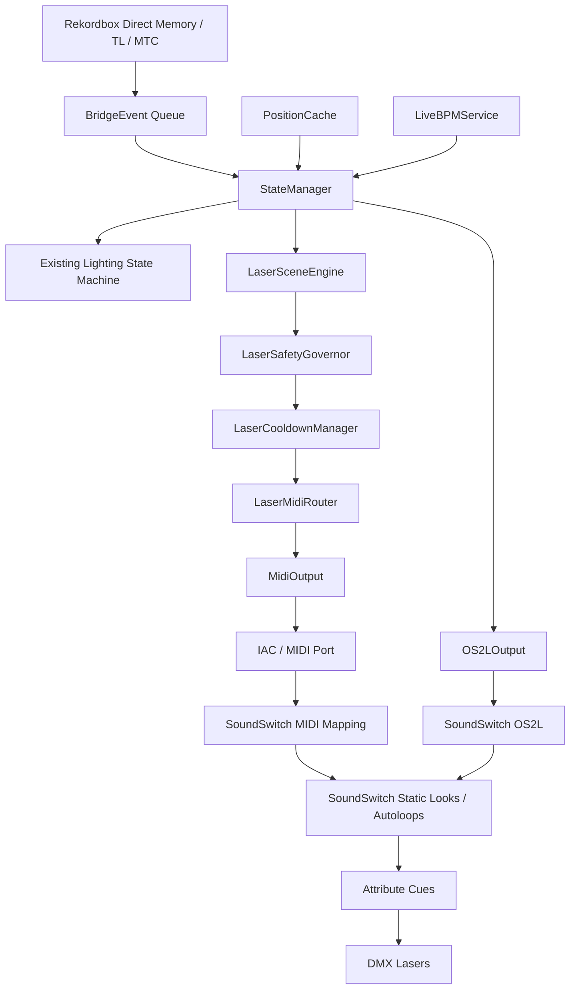

# Laser Director Design Spec

Status: PROPOSED DESIGN

Audience: coding agents, future maintainers, and implementation planners.

This document defines a proposed `Laser Director` subsystem for `rb_ss_bridge_v2`. It is written against the current architecture: a real-time Rekordbox-to-SoundSwitch bridge where `StateManager` owns deck/output state, consumes immutable `BridgeEvent`s, samples `PositionCache`, and drives SoundSwitch through `OS2LOutput`.

The current bridge already sends VirtualDJ-shaped OS2L to SoundSwitch. Laser Director adds a second output lane: MIDI commands mapped inside SoundSwitch to specific static looks and autoloops. OS2L remains responsible for timing/deck identity; MIDI becomes the explicit laser-scene selection channel.

---

## 1. Current System Context

### 1.1 Existing runtime shape

The bridge is a local macOS real-time daemon. It currently:

- Reads Rekordbox state from direct memory where guarded direct paths are available.
- Falls back to TimecodeLink and MTC where direct state is unsupported, stale, or not ready.
- Uses `StateManager` as the central authority thread.
- Sends VirtualDJ-shaped OS2L messages to SoundSwitch through `OS2LOutput`.
- Uses SoundSwitch scripted tracks and autoloops to control lighting behavior.

Important current files:

- `__main__.py` wires startup, readers, `StateManager`, `OS2LConnection`, `OS2LOutput`, command/status helpers, MTC, OSC, and validation.
- `state_manager.py` owns the 200 Hz event/push loop, deck state, output state, lighting mode decisions, Smart Drop, Smart Breakdown, Phrase Anchor, and SoundSwitch output calls.
- `models.py` defines `BridgeEvent`, `Ev`, `DeckState`, `TrackMetadata`, `PositionSnapshot`, `OutputState`, and related runtime models.
- `osl_output.py` owns OS2L TCP transport and VirtualDJ-shaped output helpers.
- `runtime_status.py` writes `/tmp/rb_ss_bridge_v2_status.json` and tails `/tmp/rb_ss_bridge_v2_commands.jsonl`.
- `config.py` defines runtime constants such as autoloop beats, phrase anchor beats, Smart Drop windows, stop debounce, and OS2L fallback endpoint.

### 1.2 Current OS2L output model

`OS2LConnection` maintains a persistent TCP connection to SoundSwitch and uses an internal sender queue so the 200 Hz push loop never blocks on socket I/O.

`OS2LOutput` sends messages such as:

- `deck N play`
- `deck N loop`
- `deck N get_loop`
- `deck N get_bpm`
- `deck N get_filepath`
- `deck N get_text '%SOUNDSWITCH_ID'`
- `deck N get_time elapsed absolute`
- `deck N get_beatpos`
- `beat` events

This lets SoundSwitch believe VirtualDJ is driving a playing deck. SoundSwitch then runs scripted tracks or autoloops.

### 1.3 Current lighting model

Today, the bridge chooses between broad modes:

```text
scripted_id > 0 and deck playing  -> scripted
scripted_id == 0 and deck playing -> autoloop
not playing                       -> idle
```

The bridge can arm scripted shows or autoloops, but it does not currently select a specific laser static look or specific laser autoloop by name.

### 1.4 New capability assumption

SoundSwitch supports MIDI mapping for:

- Static looks.
- Autoloops.
- Potentially other lighting controls depending on the local SoundSwitch configuration.

Therefore, the bridge can send MIDI commands to SoundSwitch, and SoundSwitch can map those MIDI commands to exact laser looks/autoloops. This allows Laser Director to control specific laser states without requiring direct DMX output and without fake-loading a separate track for every laser look.

---

## 2. Product Vision

Laser Director turns the bridge from a track/autoloop arming bridge into a real-time laser performance intelligence layer.

Current mental model:

```text
Rekordbox state -> Bridge -> OS2L -> SoundSwitch autoloop/scripted show -> attribute cues -> DMX lasers
```

Laser Director model:

```text
Rekordbox state + beat/phrase/drop/breakdown/transition context
    -> LaserSceneEngine
    -> MIDI mapped scene trigger
    -> SoundSwitch specific static look/autoloop
    -> attribute cues
    -> DMX lasers
```

OS2L remains active and important. MIDI does not replace OS2L. Instead:

```text
OS2L = deck identity, BPM, elapsed time, beat position, normal SoundSwitch timing
MIDI = specific laser scene selection: static look, autoloop, blackout, drop hit, buildup, transition wash
```

---

## 3. Goals

Laser Director should:

1. Trigger specific SoundSwitch MIDI-mapped static looks and autoloops.
2. Choose laser scenes from current musical context.
3. Respect phrase boundaries and existing arm-lock timing concepts.
4. Use Smart Drop, Smart Breakdown, ANLZ beatgrid, live BPM, and active deck state where available.
5. Avoid unsafe or chaotic laser behavior through cooldowns and safety rules.
6. Provide manual override and emergency blackout controls.
7. Expose status in the existing runtime status JSON.
8. Follow current architecture invariants: `StateManager` owns state, hot paths must not block, and output I/O belongs to output-specific components.

---

## 4. Non-Goals for MVP

MVP Laser Director should not:

- Directly output DMX, Art-Net, or sACN.
- Replace SoundSwitch.
- Replace existing scripted/autoloop OS2L behavior.
- Mutate `DeckState` from outside `StateManager`.
- Block inside the `StateManager` 200 Hz loop.
- Require AI/audio classification before basic operation.
- Depend on Wireshark for local MIDI inspection.

Local macOS MIDI/IAC messages are usually not visible in Wireshark. Use a MIDI monitor tool for local MIDI debugging. Wireshark remains useful for OS2L TCP inspection.

---

## 5. High-Level Architecture



Recommended module boundaries:

```text
laser_config.py       -> load/validate YAML config
laser_models.py       -> dataclasses/enums for scenes, decisions, status
laser_engine.py       -> choose desired scene from current context
laser_cooldown.py     -> cooldown and moment budgeting
laser_safety.py       -> fail-safe and safety gating
laser_midi_router.py  -> map named scene to MIDI message
midi_output.py        -> non-blocking MIDI output queue/thread
```

For MVP, these can be fewer files, but agents should keep conceptual boundaries clear.

---

## 6. Core Concepts

### 6.1 Laser Scene

A named laser intent, independent of MIDI note numbers.

Examples:

```text
safe_static
low_sweep
medium_sweep
build_tunnel
pre_drop_blackout
drop_hit
drop_sustain
breakdown_blackout
transition_wash
emergency_blackout
```

A scene maps to a MIDI command that SoundSwitch maps to a static look or autoloop.

### 6.2 Scene Type

Recommended scene types:

```text
static      -> SoundSwitch static look
autoloop    -> SoundSwitch autoloop
utility     -> blackout, disable, panic, reset, etc.
```

### 6.3 Personality

A personality is a genre/style-based rule profile.

Examples:

```text
house
techno
dubstep
open_format
safe_default
```

The personality chooses which scene to use for default groove, buildup, drop, breakdown, transition, and post-drop moments.

### 6.4 Scene Decision

`LaserSceneEngine` returns a decision object, not just a string.

Recommended model:

```python
@dataclass(frozen=True)
class LaserSceneDecision:
    scene: str
    reason: str
    priority: int
    source: str
    allow_immediate: bool = False
    target_abs_beat: Optional[int] = None
```

Example:

```text
scene=drop_hit
reason=smart_drop_on_beat
priority=90
source=smart_drop
allow_immediate=True
```

### 6.5 Laser Context

The engine needs a lightweight context built by `StateManager` during `_push_tick`.

Recommended model:

```python
@dataclass(frozen=True)
class LaserContext:
    active_deck: int
    playing: bool
    elapsed_ms: int
    bpm: float
    abs_beat: float
    phrase_beat_32: int
    phrase_beat_64: int
    position_stale: bool
    lighting_mode: str
    scripted_id: int
    filepath: str
    soundswitch_id: str
    personality: str
    smart_drops: tuple[int, ...]
    smart_breakdowns: tuple[int, ...]
    anlz_buildups: tuple[int, ...]
    next_drop_beat: Optional[int]
    beats_to_next_drop: Optional[float]
    in_breakdown: bool
    transitioning: bool
    master_recently_changed: bool
    manual_override_scene: Optional[str]
    emergency: bool
```

Do not pass mutable `DeckState` directly into Laser Director helpers unless they are called strictly inside the `StateManager` thread and never retained.

---

## 7. Decision Priority

Scene selection should follow deterministic priority order:

1. Emergency blackout.
2. Manual override.
3. Track stopped / bridge uncertain / stale position.
4. Master switch or transition-safe state.
5. Breakdown section.
6. Pre-drop runway.
7. Drop hit.
8. Post-drop sustain.
9. Phrase-boundary personality progression.
10. Default groove scene.

Example logic:

```python
def choose_scene(ctx: LaserContext, personality: LaserPersonality) -> LaserSceneDecision:
    if ctx.emergency:
        return decision("emergency_blackout", "emergency", 100, immediate=True)

    if ctx.manual_override_scene:
        return decision(ctx.manual_override_scene, "manual_override", 95, immediate=True)

    if not ctx.playing or ctx.position_stale:
        return decision(personality.safe_scene, "not_playing_or_stale", 90, immediate=True)

    if ctx.transitioning or ctx.master_recently_changed:
        return decision(personality.transition_scene, "transition", 80)

    if ctx.in_breakdown:
        return decision(personality.breakdown_scene, "breakdown", 75)

    if ctx.beats_to_next_drop is not None:
        if 0 <= ctx.beats_to_next_drop <= 0.25:
            return decision(personality.drop_scene, "drop", 90, immediate=True)
        if 0 < ctx.beats_to_next_drop <= 4:
            return decision(personality.pre_drop_scene, "pre_drop_4_beats", 85, immediate=True)
        if 4 < ctx.beats_to_next_drop <= 16:
            return decision(personality.buildup_scene, "buildup_16_beats", 70)

    if ctx.phrase_beat_32 == 0:
        return decision(personality.phrase_scene, "phrase_boundary_32", 50)

    return decision(personality.default_scene, "default", 10)
```

---

## 8. Timing Rules

Laser Director must not spam SoundSwitch MIDI mappings every 200 Hz tick.

Scene changes should usually occur only at:

- 32-beat phrase boundaries.
- 64-beat phrase anchors.
- Smart Drop pre-drop point.
- Smart Drop beat.
- Smart Breakdown start/end.
- Master-deck settled state.
- Manual override.
- Emergency blackout.

Recommended timing gates:

```text
minimum_scene_hold_beats = 8
normal_scene_changes_only_on_phrase_boundary = true
immediate_scenes = emergency_blackout, manual_blackout, pre_drop_blackout, drop_hit
```

The engine may produce a desired scene every tick, but `LaserSceneController` should only trigger MIDI when a scene transition is allowed.

Recommended state fields, owned by `StateManager` or a `LaserDirectorState` owned by `StateManager`:

```python
current_scene: str
last_scene: str
last_scene_abs_beat: float
last_scene_mono: float
last_decision_reason: str
last_midi_sent_mono: float
last_drop_hit_abs_beat: float
last_high_impact_abs_beat: float
manual_override_scene: Optional[str]
manual_override_until_mono: float
laser_enabled: bool
emergency_blackout: bool
```

Do not store these in `MidiOutput`; `MidiOutput` should not decide policy.

---

## 9. Cooldown and Moment Budgeting

Cooldown prevents lasers from feeling chaotic or unsafe.

Example rules:

```yaml
cooldowns:
  drop_hit:
    beats: 64
  high_impact:
    beats: 64
  strobe:
    beats: 128
  blackout:
    beats: 16
  aggressive_movement:
    beats: 32
```

If a desired scene is blocked by cooldown, the engine should choose a configured fallback.

Example:

```text
desired=drop_hit
blocked_by=drop_hit cooldown
fallback=drop_sustain
```

Recommended `LaserCooldownManager` API:

```python
class LaserCooldownManager:
    def filter(self, decision: LaserSceneDecision, ctx: LaserContext) -> LaserSceneDecision:
        ...

    def record_trigger(self, scene: LaserScene, abs_beat: float, mono: float) -> None:
        ...
```

Cooldown state must be mutated only in the `StateManager` thread after the MIDI trigger is accepted for enqueue.

---

## 10. Safety Governor

Lasers are higher-risk than normal fixtures. The bridge should default to safe behavior when uncertain.

Recommended fail-safe rules:

- On startup: trigger `safe_static` or `emergency_blackout` depending on config.
- On track stopped: trigger `safe_static` or `breakdown_blackout` depending on config.
- On stale position: trigger `safe_static`.
- On unknown active deck: trigger `safe_static`.
- On bridge restart/RB restart: clear state and trigger configured safe scene.
- During transitions: block high-impact/strobe scenes by default.
- If MIDI output is unavailable: log and mark Laser Director degraded; do not block OS2L.
- If SoundSwitch OS2L is disconnected: MIDI can continue only if explicitly allowed. Default should be safe scene only.

Recommended safety classes:

```text
safe
movement_low
movement_medium
movement_high
high_impact
strobe
blackout
```

Example safety config:

```yaml
safety:
  startup_scene: safe_static
  stop_scene: safe_static
  stale_position_scene: safe_static
  emergency_scene: emergency_blackout
  block_high_impact_while_transitioning: true
  block_strobe_while_transitioning: true
  require_position_fresh_for_drop_hit: true
  allow_midi_when_os2l_disconnected: false
```

---

## 11. MIDI Output Design

### 11.1 `MidiOutput`

`MidiOutput` should mirror `OS2LConnection` design principles:

- Own MIDI I/O on its own thread.
- Provide a queue so callers never block.
- Reconnect if possible.
- Expose status for runtime snapshots.
- Log dropped messages.
- Support note pulse, note on/off, and control change.

Recommended API:

```python
class MidiOutput:
    def start(self) -> None: ...
    def stop(self) -> None: ...
    def trigger(self, msg: LaserMidiMessage) -> bool: ...
    def panic(self) -> None: ...
    def status(self) -> dict: ...
```

Recommended message model:

```python
@dataclass(frozen=True)
class LaserMidiMessage:
    type: str              # note_pulse | note_on | note_off | cc
    channel: int = 1
    note: int = 0
    velocity: int = 127
    cc: int = 0
    value: int = 0
    duration_ms: int = 80
```

### 11.2 MIDI port

On macOS, use IAC Driver as the first target:

```text
Bridge MIDI Out -> IAC Driver Bus -> SoundSwitch MIDI Input
```

Use a local MIDI monitor tool to inspect messages. Wireshark usually will not show local IAC/USB MIDI. Wireshark is useful only if MIDI is carried over network transport.

### 11.3 Note pulse default

For SoundSwitch MIDI mapping, the safest default is usually a button-like note pulse:

```text
note_on velocity 127
wait 50-100 ms
note_off velocity 0
```

Support long note-on and CC modes for mappings that require toggle/hold/fader behavior.

---

## 12. Config Schema

Recommended config file:

```text
config/laser_director.yaml
```

Example:

```yaml
laser_director:
  enabled: true
  midi_output_port: "IAC Driver Bus 2"
  default_personality: "house"
  minimum_scene_hold_beats: 8
  normal_changes_only_on_phrase_boundary: true

safety:
  startup_scene: safe_static
  stop_scene: safe_static
  stale_position_scene: safe_static
  emergency_scene: emergency_blackout
  block_high_impact_while_transitioning: true
  block_strobe_while_transitioning: true
  require_position_fresh_for_drop_hit: true
  allow_midi_when_os2l_disconnected: false

scenes:
  safe_static:
    type: static
    safety_class: safe
    fallback_scene: safe_static
    midi:
      type: note_pulse
      channel: 1
      note: 36
      velocity: 127
      duration_ms: 80

  low_sweep:
    type: autoloop
    safety_class: movement_low
    fallback_scene: safe_static
    midi:
      type: note_pulse
      channel: 1
      note: 37
      velocity: 127
      duration_ms: 80

  build_tunnel:
    type: autoloop
    safety_class: movement_medium
    fallback_scene: low_sweep
    cooldown_beats: 16
    midi:
      type: note_pulse
      channel: 1
      note: 38
      velocity: 127
      duration_ms: 80

  pre_drop_blackout:
    type: static
    safety_class: blackout
    fallback_scene: safe_static
    cooldown_beats: 8
    midi:
      type: note_pulse
      channel: 1
      note: 39
      velocity: 127
      duration_ms: 80

  drop_hit:
    type: static
    safety_class: high_impact
    fallback_scene: drop_sustain
    cooldown_beats: 64
    midi:
      type: note_pulse
      channel: 1
      note: 40
      velocity: 127
      duration_ms: 80

  drop_sustain:
    type: autoloop
    safety_class: movement_high
    fallback_scene: low_sweep
    cooldown_beats: 16
    midi:
      type: note_pulse
      channel: 1
      note: 41
      velocity: 127
      duration_ms: 80

  breakdown_blackout:
    type: static
    safety_class: blackout
    fallback_scene: safe_static
    midi:
      type: note_pulse
      channel: 1
      note: 42
      velocity: 127
      duration_ms: 80

  transition_wash:
    type: static
    safety_class: safe
    fallback_scene: safe_static
    midi:
      type: note_pulse
      channel: 1
      note: 43
      velocity: 127
      duration_ms: 80

  emergency_blackout:
    type: utility
    safety_class: safe
    midi:
      type: note_pulse
      channel: 1
      note: 44
      velocity: 127
      duration_ms: 80

personalities:
  house:
    safe_scene: safe_static
    default_scene: low_sweep
    phrase_scene: low_sweep
    buildup_scene: build_tunnel
    pre_drop_scene: build_tunnel
    drop_scene: drop_sustain
    post_drop_scene: drop_sustain
    breakdown_scene: safe_static
    transition_scene: transition_wash
    allow_high_impact: false
    phrase_interval_beats: 32

  dubstep:
    safe_scene: safe_static
    default_scene: low_sweep
    phrase_scene: low_sweep
    buildup_scene: build_tunnel
    pre_drop_scene: pre_drop_blackout
    drop_scene: drop_hit
    post_drop_scene: drop_sustain
    breakdown_scene: breakdown_blackout
    transition_scene: transition_wash
    allow_high_impact: true
    phrase_interval_beats: 16

cooldowns:
  high_impact:
    beats: 64
  strobe:
    beats: 128
  aggressive_movement:
    beats: 32
```

---

## 13. Genre / Personality Resolution

MVP should not require AI genre classification. Use deterministic resolution.

Recommended priority:

1. Manual track profile by filepath or SoundSwitch ID.
2. Rekordbox/audio tag genre if available.
3. Folder/path hints.
4. Playlist hints if exposed later.
5. Default personality.

Recommended profile config:

```yaml
track_profiles:
  by_filepath:
    "/Users/bbui/Music/Dubstep/song_a.mp3":
      personality: dubstep

  by_folder_contains:
    "/Dubstep/": dubstep
    "/Techno/": techno
    "/House/": house

  by_genre_tag:
    "Dubstep": dubstep
    "Bass House": dubstep
    "Techno": techno
    "House": house
```

Future `TrackMetadata` can add:

```python
genre: str = ""
laser_personality: str = ""
```

Until then, resolve personality from filepath and config.

---

## 14. Integration with Current Code

### 14.1 `__main__.py`

Add startup wiring near OS2L output creation:

```python
laser_config = load_laser_director_config()
midi_output = MidiOutput(laser_config.midi_output_port)
laser_director = LaserDirector(
    config=laser_config,
    midi_output=midi_output,
)

midi_output.start()
sm = StateManager(event_queue, pos_cache, output, live_bpm=live_bpm, laser_director=laser_director)
```

Keep MIDI optional. If config is disabled or MIDI port is unavailable, the bridge should still run normally.

### 14.2 `StateManager.__init__`

Add optional dependency:

```python
def __init__(..., live_bpm=None, live_bpm_follow=None, laser_director=None):
    self._laser_director = laser_director
```

Initialize Laser Director state inside `StateManager`, not in the MIDI thread.

### 14.3 `StateManager._push_tick`

After current position/BPM/beat context is computed, call Laser Director.

Recommended placement:

- After active deck, elapsed, BPM, beat position, and absolute beat are known.
- After Smart Drop / Smart Breakdown state is available.
- Before or after OS2L beat sends is acceptable, but drop-hit MIDI should be enqueued before the corresponding beat event if the desired behavior depends on SoundSwitch seeing the scene first.

Conceptual hook:

```python
if self._laser_director is not None:
    ctx = self._build_laser_context(active, d, os, elapsed_ms, bpm, abs_beat, snap)
    decision = self._laser_director.evaluate(ctx)
    if decision.trigger:
        self._laser_director.trigger(decision)
```

Do not block. `trigger()` must only enqueue MIDI output.

### 14.4 `models.py`

Add Laser Director event kinds only if manual commands should flow through `BridgeEvent`.

Suggested new `Ev` values:

```python
LASER_TOGGLE = "laser_toggle"
LASER_SCENE = "laser_scene"
LASER_BLACKOUT = "laser_blackout"
LASER_CLEAR_OVERRIDE = "laser_clear_override"
LASER_SET_PERSONALITY = "laser_set_personality"
```

Manual commands that mutate Laser Director state should enqueue events to `StateManager`, matching the existing Smart Drop toggle pattern.

### 14.5 `runtime_status.py`

Extend command allowlist:

```text
toggle_laser_director
laser_blackout
laser_scene
laser_clear_override
laser_set_personality
laser_set_energy
```

Do not mutate `StateManager` state directly inside `CommandReader`. Instead, pass callbacks from `__main__.py` that enqueue `BridgeEvent`s, exactly like `toggle_smart_drop` and `toggle_smart_breakdown`.

### 14.6 `StatusWriter`

Add Laser Director status to `/tmp/rb_ss_bridge_v2_status.json`:

```json
"laser_director": {
  "enabled": true,
  "midi": {
    "connected": true,
    "port": "IAC Driver Bus 2",
    "queue_size": 0,
    "sent_count": 123,
    "drop_count": 0
  },
  "current_scene": "low_sweep",
  "last_scene": "build_tunnel",
  "last_reason": "phrase_boundary_32",
  "last_trigger_abs_beat": 96,
  "personality": "house",
  "manual_override": null,
  "emergency": false,
  "cooldowns": {
    "drop_hit_remaining_beats": 32
  }
}
```

### 14.7 `validation_runner.py`

Add optional validation checks:

- MIDI port available.
- Laser Director config parses.
- Every personality references existing scenes.
- Every scene has valid MIDI mapping.
- Emergency scene exists.
- Safe scene exists.

---

## 15. Manual Override Commands

Recommended commands through `/tmp/rb_ss_bridge_v2_commands.jsonl`:

```json
{"cmd":"toggle_laser_director"}
{"cmd":"laser_blackout"}
{"cmd":"laser_scene","scene":"drop_hit","ttl_s":4}
{"cmd":"laser_clear_override"}
{"cmd":"laser_set_personality","personality":"dubstep"}
```

Manual override policy:

```text
emergency blackout > manual override > safety governor > cooldown manager > automatic scene engine
```

Manual override should support TTL so it cannot accidentally trap the show in a scene forever.

---

## 16. SoundSwitch Setup Workflow

1. Enable IAC Driver on macOS.
2. Create a dedicated IAC bus, for example `IAC Driver Bus 2`.
3. Configure SoundSwitch to listen to that MIDI input.
4. Map MIDI notes to static looks/autoloops.
5. Mirror those mappings in `config/laser_director.yaml`.
6. Use a MIDI monitor app to verify note pulses from the bridge.
7. Use bridge logs/status JSON to confirm scene decisions.

Example mapping table:

| Scene | MIDI | SoundSwitch Mapping |
|---|---:|---|
| `safe_static` | note 36 | Laser static safe look |
| `low_sweep` | note 37 | Laser low movement autoloop |
| `build_tunnel` | note 38 | Laser buildup tunnel autoloop |
| `pre_drop_blackout` | note 39 | Laser blackout/static tension look |
| `drop_hit` | note 40 | Laser drop impact static/look |
| `drop_sustain` | note 41 | Laser aggressive/wide autoloop |
| `breakdown_blackout` | note 42 | Laser breakdown blackout |
| `transition_wash` | note 43 | Safe transition look |
| `emergency_blackout` | note 44 | Emergency laser blackout |

---

## 17. Logging

Use summary-centric logs. Avoid per-tick spam.

Recommended log lines:

```text
[LASER] enabled  midi_port="IAC Driver Bus 2"  scenes=9  personalities=3
[LASER] scene  safe_static→build_tunnel  reason=phrase_boundary_32  beat=96  deck=1
[LASER] scene  build_tunnel→drop_hit  reason=drop  beat=128  deck=1
[LASER] blocked  scene=drop_hit  reason=cooldown  fallback=drop_sustain  remaining_beats=32
[LASER] safe  scene=safe_static  reason=position_stale
[LASER] midi-send  scene=drop_hit  note=40  channel=1
[LASER] midi-unavailable  port="IAC Driver Bus 2"  action=disable_laser_director
```

---

## 18. Testing Strategy

### 18.1 Unit tests

Add tests for:

- Config parsing.
- Scene reference validation.
- Personality resolution.
- Decision priority.
- Cooldown fallback.
- Safety governor behavior.
- Manual override TTL.
- MIDI message construction.

### 18.2 Trace replay tests

Use recorded bridge events to verify:

- Scene changes happen at expected phrase boundaries.
- Drop MIDI triggers happen before/on the expected beat.
- Breakdown scenes trigger only in configured windows.
- Transitions suppress high-impact scenes.

### 18.3 Runtime validation

Add `run_validation` checks:

- MIDI output port exists.
- MIDI output can open.
- Safe scene configured.
- Emergency scene configured.
- All scene MIDI mappings are valid.

### 18.4 Live dry-run mode

Add config:

```yaml
laser_director:
  dry_run: true
```

Dry run logs decisions but does not send MIDI.

---

## 19. Implementation Phases

### Phase 0: Discovery

- Confirm SoundSwitch MIDI mapping behavior.
- Determine whether SoundSwitch expects note pulses, toggles, or CC messages.
- Build a mapping table of notes to static looks/autoloops.

### Phase 1: MIDI Output MVP

- Add `midi_output.py`.
- Open configured IAC output port.
- Send note pulse.
- Add status and logging.
- Add validation check.

### Phase 2: Manual Scene Trigger

- Add `laser_scenes.yaml` parsing.
- Add runtime command `laser_scene`.
- Allow manual scene trigger by name.
- Confirm SoundSwitch fires exact static/autoloop.

### Phase 3: Automatic Phrase Scenes

- Add `LaserSceneEngine`.
- Trigger default/phrase scene on 32-beat boundaries.
- Add minimum scene hold.
- Add safe scene on stop/stale position.

### Phase 4: Smart Drop / Smart Breakdown Integration

- Trigger buildup/pre-drop/drop/post-drop scenes from `smart_drops`.
- Trigger breakdown/restore scenes from `smart_breakdowns` and buildups.
- Add cooldown manager.

### Phase 5: Personalities

- Add default personality.
- Add filepath/folder/tag-based personality resolution.
- Add runtime personality override.

### Phase 6: Safety and UI Polish

- Add emergency blackout command.
- Add menu bar controls.
- Add status JSON fields.
- Add dry-run mode.
- Add trace replay validation.

---

## 20. Agent Implementation Rules

Agents implementing this feature must follow these rules:

1. Do not block in `StateManager._push_tick`.
2. Do not perform MIDI I/O directly from `StateManager`; enqueue to `MidiOutput`.
3. Do not mutate `DeckState` outside `StateManager`.
4. Runtime commands that change Laser Director state must enqueue `BridgeEvent`s.
5. Keep OS2L behavior unchanged unless explicitly working on OS2L integration.
6. Laser Director must fail safe: stale/unknown state should select a safe scene.
7. MIDI output failure must not crash the bridge.
8. Config errors should disable Laser Director, not the entire bridge, unless strict mode is explicitly enabled.
9. Scene changes must be rate-limited and phrase-aware.
10. Emergency blackout must bypass normal timing gates and cooldowns.
11. Do not require AI, cloud services, or network connectivity for MVP.
12. Add status JSON fields for observability before enabling automatic live behavior.
13. Add dry-run mode before live MIDI sends are enabled by default.
14. Preserve existing Smart Drop, Smart Breakdown, Phrase Anchor, and OS2L invariants.

---

## 21. Open Questions

1. Does SoundSwitch prefer note pulse, note toggle, or CC for the target mappings?
2. Can SoundSwitch MIDI mappings distinguish static look vs autoloop activation cleanly?
3. Does triggering a static look stop the currently active autoloop, or do they layer?
4. Should Laser Director trigger scenes on active/mirror/3/4 conceptually, or is MIDI mapping global inside SoundSwitch?
5. Should high-impact scenes require a manual `arm_live` style safety window?
6. Should `drop_hit` be fired before the OS2L beat event on the same tick to ensure SoundSwitch state is ready?
7. Should automatic high-impact laser moments be disabled by default until manually enabled per session?
8. Should dry-run be the default for first release?

---

## 22. Recommended MVP Acceptance Criteria

MVP is complete when:

1. Bridge can open configured MIDI output port.
2. Bridge can send named MIDI scene triggers manually through command JSONL.
3. SoundSwitch receives MIDI and triggers exact mapped static looks/autoloops.
4. Laser Director config is validated at startup.
5. Status JSON shows MIDI output and current laser scene status.
6. Automatic mode can trigger a safe/default scene on phrase boundaries.
7. Automatic mode can trigger `pre_drop` and `drop` scenes from Smart Drop data.
8. Cooldown prevents repeated high-impact scenes.
9. Emergency blackout can be triggered immediately.
10. Disabling Laser Director restores current bridge behavior with no OS2L regression.

---

## 23. Final Design Summary

Laser Director should be implemented as a policy layer inside the existing bridge architecture, not as a separate process and not as direct DMX control.

The current bridge already knows the important musical facts: active deck, play state, BPM, elapsed time, beat position, phrase timing, Smart Drop, Smart Breakdown, and track metadata. Laser Director converts those facts into named laser scene decisions. A MIDI router maps those decisions to SoundSwitch MIDI mappings. SoundSwitch remains responsible for DMX output and attribute cues.

The guiding principle:

```text
StateManager decides when and why.
LaserSceneEngine decides what.
LaserMidiRouter decides which MIDI mapping.
MidiOutput sends without blocking.
SoundSwitch executes the laser look/autoloop through existing attribute cues.
```

This gives the bridge precise control over specific laser static looks and autoloops while preserving the current OS2L timing architecture and fail-closed runtime design.
