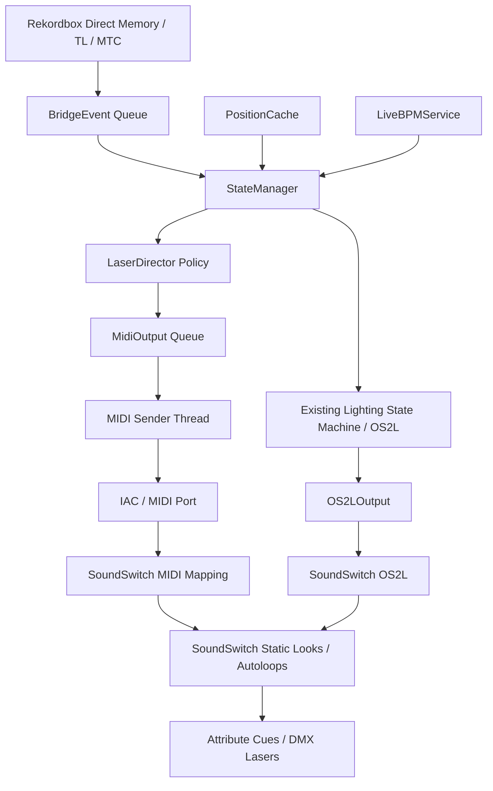

# Laser Director Design Spec

Status: PROPOSED DESIGN — REFINED AGAINST CURRENT CODEBASE

Audience: AI coding agents, future maintainers, and implementation reviewers.

This document defines a proposed `Laser Director` subsystem for `rb_ss_bridge_v2`. It has been revised against the current architecture: `StateManager` is the single authority for deck/output policy state, consumes immutable `BridgeEvent`s, samples `PositionCache`, uses `LiveBPMService`, and drives SoundSwitch through `OS2LOutput`.

Laser Director adds a second output lane: MIDI commands mapped inside SoundSwitch to specific laser static looks and autoloops. MIDI does not replace OS2L. OS2L remains responsible for deck identity, BPM, elapsed time, beat position, play/loop state, scripted/autoloop activation, and normal SoundSwitch timing. MIDI is only the explicit laser-scene selection channel.

---

## 1. Current Architecture Facts

The current bridge is a local macOS realtime daemon. It:

- Reads guarded direct Rekordbox state where available.
- Falls back to TimecodeLink and MTC where direct state is unsupported, stale, or not ready.
- Uses `StateManager` as the central authority thread.
- Publishes immutable `BridgeEvent`s into a queue.
- Samples direct position through `PositionCache`.
- Uses `LiveBPMService` where available.
- Sends VirtualDJ-shaped OS2L to SoundSwitch through `OS2LOutput`.
- Exposes operator status and commands through `/tmp/rb_ss_bridge_v2_status.json` and `/tmp/rb_ss_bridge_v2_commands.jsonl`.

Relevant current files:

- `__main__.py` wires startup, event queues, readers, `StateManager`, `OS2LConnection`, `OS2LOutput`, command/status helpers, validation, MTC, OSC, and direct readers.
- `state_manager.py` owns the 200 Hz event/push loop, `DeckState`, most `OutputState`, lighting mode decisions, Smart Drop, Smart Breakdown, Phrase Anchor, and SoundSwitch output calls.
- `models.py` defines `BridgeEvent`, `Ev`, `DeckState`, `TrackMetadata`, `PositionSnapshot`, `OutputState`, and related runtime models.
- `osl_output.py` owns OS2L TCP transport and VirtualDJ-shaped output helpers.
- `runtime_status.py` writes status JSON and tails the command JSONL file with a hardcoded command allowlist.
- `validation_runner.py` runs diagnostics against the bridge process, SoundSwitch connection, memory freshness, live BPM, autoloop/scripted state, and OS2L queue.
- `config.py` currently uses constants and environment flags; there is no existing general YAML config loader pattern.

Implementation must treat code as the source of truth.

---

## 2. Product Goal

Laser Director turns the bridge from broad scripted/autoloop arming into a realtime laser scene director.

Current model:

```text
Rekordbox state -> Bridge -> OS2L -> SoundSwitch scripted/autoloop behavior -> fixtures
```

Laser Director model:

```text
Rekordbox state + beat/phrase/drop/breakdown/transition context
    -> StateManager-owned LaserDirector policy
    -> MidiOutput queue/thread
    -> IAC or MIDI port
    -> SoundSwitch MIDI mapping
    -> specific static laser look or laser autoloop
```

OS2L and MIDI have separate responsibilities:

```text
OS2L = deck/timing/playback identity and normal SoundSwitch timing
MIDI = explicit laser scene selection
```

---

## 3. MVP Goals

Laser Director MVP should:

1. Load and validate a laser scene mapping config at startup.
2. Start disabled by default unless explicitly enabled.
3. Support dry-run mode.
4. Support manual scene trigger by name.
5. Support emergency blackout.
6. Support safe scene on stop, stale position, unknown active deck, bridge restart, or degraded state.
7. Support simple automatic phrase/default scene changes.
8. Add Smart Drop / Smart Breakdown integration only after manual and phrase behavior are validated.
9. Publish Laser Director status to the existing runtime status JSON.
10. Add validation checks for config and MIDI transport.
11. Preserve all existing OS2L behavior when disabled or degraded.

---

## 4. Non-Goals

MVP must not:

- Output DMX, Art-Net, or sACN directly.
- Replace SoundSwitch.
- Replace OS2L.
- Mutate `DeckState` outside `StateManager`.
- Block inside `StateManager._push_tick`.
- Perform MIDI I/O from `StateManager`.
- Require AI/audio classification.
- Require network access.
- Depend on Wireshark for local MIDI debugging.
- Add genre-tag personality resolution unless metadata ingestion is explicitly extended.

Use a MIDI monitor for local macOS IAC/USB MIDI debugging. Wireshark is useful for OS2L TCP inspection, not local MIDI.

---

## 5. Architectural Invariants

Implementation agents must preserve these invariants:

1. `StateManager` owns `DeckState` and output policy state.
2. Other threads publish immutable `BridgeEvent`s or snapshots; they do not mutate deck/output state.
3. `_push_tick` is a 200 Hz hot path. It must not perform file I/O, MIDI I/O, socket I/O, subprocess calls, blocking queue operations, or unbounded work.
4. Output transports own their own I/O threads and bounded queues.
5. Runtime commands that affect bridge state must enqueue `BridgeEvent`s.
6. Status JSON must be generated from snapshots/status methods, not live mutable objects.
7. MIDI failure must not crash or block OS2L behavior.
8. Config failure must disable Laser Director unless a future strict mode is explicitly added.

---

## 6. High-Level Architecture



MVP module set:

```text
laser_models.py       -> frozen dataclasses/enums for scenes, MIDI messages, decisions, context, status
laser_config.py       -> load and validate Laser Director config
laser_director.py     -> policy, timing gates, cooldowns, safety, manual override state
midi_output.py        -> non-blocking MIDI output queue/thread
```

Do not split `laser_safety.py`, `laser_cooldown.py`, or `laser_midi_router.py` until MVP complexity justifies it.

---

## 7. Data Models

Add Laser Director models in `laser_models.py`.

```python
@dataclass(frozen=True)
class LaserMidiMessage:
    kind: str  # "note_pulse", "note_on", "note_off", "cc"
    channel: int = 1
    note: int = 0
    velocity: int = 127
    cc: int = 0
    value: int = 0
    duration_ms: int = 80


@dataclass(frozen=True)
class LaserScene:
    name: str
    scene_type: str  # "static", "autoloop", "utility"
    safety_class: str  # "safe", "movement_low", "movement_medium", "movement_high", "high_impact", "strobe", "blackout"
    midi: LaserMidiMessage
    fallback_scene: str = "safe_static"
    cooldown_beats: float = 0.0
    immediate: bool = False


@dataclass(frozen=True)
class LaserPersonality:
    name: str
    safe_scene: str
    default_scene: str
    phrase_scene: str
    buildup_scene: str
    pre_drop_scene: str
    drop_scene: str
    post_drop_scene: str
    breakdown_scene: str
    transition_scene: str
    allow_high_impact: bool = False
    phrase_interval_beats: int = 32


@dataclass(frozen=True)
class LaserContext:
    active_deck: int
    playing: bool
    elapsed_ms: int
    bpm: float
    beatpos: float
    abs_beat: float
    phrase_beat_32: int
    phrase_beat_64: int
    position_stale: bool
    lighting_mode: str
    scripted_id: int
    filepath: str
    soundswitch_id: str
    personality: str
    smart_drops: tuple[int, ...]
    smart_breakdowns: tuple[int, ...]
    anlz_buildups: tuple[int, ...]
    next_drop_beat: int | None
    beats_to_next_drop: float | None
    in_breakdown: bool
    transitioning: bool
    master_recently_changed: bool
    manual_override_scene: str | None
    emergency: bool
    os2l_connected: bool


@dataclass(frozen=True)
class LaserSceneDecision:
    scene: str
    reason: str
    priority: int
    source: str
    allow_immediate: bool = False
    target_abs_beat: int | None = None
    blocked: bool = False
    blocked_reason: str = ""
```

Do not pass mutable `DeckState` into Laser Director except transiently inside the `StateManager` thread. Prefer building a frozen `LaserContext`.

---

## 8. Configuration

Current code does not establish a general YAML-loader pattern. MVP should either:

1. Use JSON/TOML to avoid adding a dependency, or
2. Explicitly add PyYAML and document/test the dependency.

Recommended MVP path: `config/laser_director.json`.

Example schema:

```json
{
  "laser_director": {
    "enabled": false,
    "dry_run": true,
    "midi_output_port": "IAC Driver Bus 2",
    "default_personality": "house",
    "minimum_scene_hold_beats": 8,
    "normal_changes_only_on_phrase_boundary": true
  },
  "safety": {
    "startup_scene": "safe_static",
    "stop_scene": "safe_static",
    "stale_position_scene": "safe_static",
    "emergency_scene": "emergency_blackout",
    "block_high_impact_while_transitioning": true,
    "block_strobe_while_transitioning": true,
    "require_position_fresh_for_drop_hit": true,
    "allow_midi_when_os2l_disconnected": false
  },
  "scenes": {
    "safe_static": {
      "type": "static",
      "safety_class": "safe",
      "fallback_scene": "safe_static",
      "midi": {"kind": "note_pulse", "channel": 1, "note": 36, "velocity": 127, "duration_ms": 80}
    },
    "low_sweep": {
      "type": "autoloop",
      "safety_class": "movement_low",
      "fallback_scene": "safe_static",
      "midi": {"kind": "note_pulse", "channel": 1, "note": 37, "velocity": 127, "duration_ms": 80}
    },
    "build_tunnel": {
      "type": "autoloop",
      "safety_class": "movement_medium",
      "fallback_scene": "low_sweep",
      "cooldown_beats": 16,
      "midi": {"kind": "note_pulse", "channel": 1, "note": 38, "velocity": 127, "duration_ms": 80}
    },
    "pre_drop_blackout": {
      "type": "static",
      "safety_class": "blackout",
      "fallback_scene": "safe_static",
      "cooldown_beats": 8,
      "midi": {"kind": "note_pulse", "channel": 1, "note": 39, "velocity": 127, "duration_ms": 80}
    },
    "drop_hit": {
      "type": "static",
      "safety_class": "high_impact",
      "fallback_scene": "drop_sustain",
      "cooldown_beats": 64,
      "midi": {"kind": "note_pulse", "channel": 1, "note": 40, "velocity": 127, "duration_ms": 80}
    },
    "drop_sustain": {
      "type": "autoloop",
      "safety_class": "movement_high",
      "fallback_scene": "low_sweep",
      "cooldown_beats": 16,
      "midi": {"kind": "note_pulse", "channel": 1, "note": 41, "velocity": 127, "duration_ms": 80}
    },
    "breakdown_blackout": {
      "type": "static",
      "safety_class": "blackout",
      "fallback_scene": "safe_static",
      "midi": {"kind": "note_pulse", "channel": 1, "note": 42, "velocity": 127, "duration_ms": 80}
    },
    "transition_wash": {
      "type": "static",
      "safety_class": "safe",
      "fallback_scene": "safe_static",
      "midi": {"kind": "note_pulse", "channel": 1, "note": 43, "velocity": 127, "duration_ms": 80}
    },
    "emergency_blackout": {
      "type": "utility",
      "safety_class": "safe",
      "fallback_scene": "safe_static",
      "midi": {"kind": "note_pulse", "channel": 1, "note": 44, "velocity": 127, "duration_ms": 80}
    }
  },
  "personalities": {
    "house": {
      "safe_scene": "safe_static",
      "default_scene": "low_sweep",
      "phrase_scene": "low_sweep",
      "buildup_scene": "build_tunnel",
      "pre_drop_scene": "build_tunnel",
      "drop_scene": "drop_sustain",
      "post_drop_scene": "drop_sustain",
      "breakdown_scene": "safe_static",
      "transition_scene": "transition_wash",
      "allow_high_impact": false,
      "phrase_interval_beats": 32
    },
    "dubstep": {
      "safe_scene": "safe_static",
      "default_scene": "low_sweep",
      "phrase_scene": "low_sweep",
      "buildup_scene": "build_tunnel",
      "pre_drop_scene": "pre_drop_blackout",
      "drop_scene": "drop_hit",
      "post_drop_scene": "drop_sustain",
      "breakdown_scene": "breakdown_blackout",
      "transition_scene": "transition_wash",
      "allow_high_impact": true,
      "phrase_interval_beats": 16
    }
  },
  "track_profiles": {
    "by_filepath": {},
    "by_soundswitch_id": {},
    "by_folder_contains": {}
  }
}
```

Validation requirements:

- Config file missing: Laser Director unavailable/disabled, bridge still starts.
- Malformed config: Laser Director disabled with warning/validation failure, bridge still starts.
- `enabled` and `dry_run` must be booleans.
- `dry_run` defaults to `true`.
- Every scene must define a valid MIDI mapping.
- Every personality scene reference must point to an existing scene.
- Startup, stop, stale, emergency scenes must exist.
- Fallback scenes must exist.
- MIDI channel/note/CC/value ranges must be valid.
- Default personality must exist.

---

## 9. MIDI Output Design

Add `midi_output.py`, modeled after `OS2LConnection`.

Required API:

```python
class MidiOutput:
    def start(self) -> None: ...
    def stop(self) -> None: ...
    def trigger(self, msg: LaserMidiMessage) -> bool: ...
    def panic(self) -> None: ...
    def status(self) -> dict: ...
```

Rules:

1. Own MIDI I/O on a dedicated sender thread.
2. Use a bounded queue.
3. `trigger()` must use `put_nowait()` and return `False` if the queue is full.
4. Queue full increments `drop_count` and logs a summary warning.
5. MIDI library or port failure marks output degraded and returns `False`.
6. Dry-run accepts triggers and updates counters/status without sending MIDI.
7. `note_pulse` sends note-on, waits `duration_ms`, then sends note-off inside the MIDI sender thread only.
8. `MidiOutput` never chooses scenes and never owns policy state.

Status shape:

```json
{
  "enabled": true,
  "dry_run": true,
  "connected": false,
  "port": "IAC Driver Bus 2",
  "queue_size": 0,
  "queue_max": 256,
  "sent_count": 0,
  "drop_count": 0,
  "send_error_count": 0,
  "last_error": ""
}
```

---

## 10. LaserDirector Policy

Add `LaserDirector` in `laser_director.py`.

Responsibilities:

- Own Laser Director policy state.
- Evaluate `LaserContext`.
- Apply priority, safety, cooldown, manual override, and timing gates.
- Map selected scene to `LaserMidiMessage`.
- Enqueue MIDI through `MidiOutput`.
- Expose `status()`.

Priority order:

1. Emergency blackout.
2. Manual override.
3. Disabled/degraded/dry-run accounting.
4. Not playing, stale position, or unknown active deck.
5. OS2L disconnected, unless explicitly allowed by config.
6. Transition/master-change safe scene.
7. Breakdown scene.
8. Pre-drop/drop/post-drop scenes.
9. Phrase-boundary scene.
10. Default scene.

Timing gates:

- Emergency blackout bypasses all timing/cooldown gates.
- Manual blackout bypasses normal timing gates.
- Safe/stale/stop scenes bypass normal phrase timing.
- Normal scene changes respect `minimum_scene_hold_beats`.
- Normal scene changes occur only at configured phrase boundaries when `normal_changes_only_on_phrase_boundary=true`.
- Drop/pre-drop scenes may be immediate only when configured and position is fresh.

Cooldown state is updated only after `MidiOutput.trigger()` accepts the message.

---

## 11. StateManager Integration

Modify `StateManager.__init__`:

```python
def __init__(..., live_bpm=None, live_bpm_follow=None, laser_director=None, os2l_status_provider=None):
    self._laser_director = laser_director
    self._os2l_status_provider = os2l_status_provider
```

`LaserDirector` policy state can live inside `LaserDirector`, but it must only be mutated from the `StateManager` thread after startup. Do not mutate it from command/status/MIDI threads.

Add event handling in `_handle_event`:

```python
elif ev.kind == Ev.LASER_TOGGLE:
    self._laser_director.set_enabled(bool(ev.payload.get("enabled", True)))
elif ev.kind == Ev.LASER_SCENE:
    self._laser_director.set_manual_override(str(ev.payload.get("scene", "")), float(ev.payload.get("ttl_s", 0)))
elif ev.kind == Ev.LASER_BLACKOUT:
    self._laser_director.set_emergency_blackout(True)
elif ev.kind == Ev.LASER_CLEAR_OVERRIDE:
    self._laser_director.clear_manual_override()
elif ev.kind == Ev.LASER_SET_PERSONALITY:
    self._laser_director.set_personality(str(ev.payload.get("personality", "")))
```

Add `LaserContext` construction in `_push_tick` after active deck, play state, elapsed, BPM, beat position, absolute beat, lighting mode, Smart Drop, and Smart Breakdown state are known.

```python
if self._laser_director is not None:
    ctx = self._build_laser_context(...)
    self._laser_director.tick(ctx, now=time.monotonic())
```

`tick()` must be bounded and non-blocking.

Cross-transport ordering note: OS2L and MIDI use separate queues/threads, so enqueueing MIDI before an OS2L beat is best-effort only. If strict alignment is required later, add measured lead/offset configuration.

---

## 12. Event Model

Add to `models.py`:

```python
LASER_TOGGLE = "laser_toggle"
LASER_SCENE = "laser_scene"
LASER_BLACKOUT = "laser_blackout"
LASER_CLEAR_OVERRIDE = "laser_clear_override"
LASER_SET_PERSONALITY = "laser_set_personality"
```

Manual commands must flow through `BridgeEvent`s, matching the existing Smart Drop / Smart Breakdown command pattern.

---

## 13. Runtime Commands

Extend `runtime_status.py`.

Allowed commands:

```text
toggle_laser_director
laser_blackout
laser_scene
laser_clear_override
laser_set_personality
```

Examples:

```json
{"cmd":"toggle_laser_director"}
{"cmd":"laser_blackout"}
{"cmd":"laser_scene","scene":"drop_hit","ttl_s":4}
{"cmd":"laser_clear_override"}
{"cmd":"laser_set_personality","personality":"dubstep"}
```

Parser rules:

- `laser_scene.scene` must be a non-empty string.
- `ttl_s` must be clamped to a safe maximum, recommended 30 seconds.
- `laser_set_personality.personality` must be non-empty.
- Actual scene/personality existence validation belongs in `LaserDirector`.

`CommandReader` should not mutate `LaserDirector` directly. Add optional callbacks supplied by `__main__.py`; those callbacks enqueue `BridgeEvent`s.

---

## 14. Startup Wiring

Modify `__main__.py` near OS2L setup.

```python
laser_director = None
midi_output = None
laser_config_result = load_laser_director_config()

if laser_config_result.available:
    midi_output = MidiOutput(
        port=laser_config_result.config.midi_output_port,
        dry_run=laser_config_result.config.dry_run,
    )
    midi_output.start()
    laser_director = LaserDirector(
        config=laser_config_result.config,
        midi_output=midi_output,
        os2l_status_provider=conn.status,
    )

sm = StateManager(
    event_queue,
    pos_cache,
    output,
    live_bpm=live_bpm,
    laser_director=laser_director,
    os2l_status_provider=conn.status,
)
```

Pass optional Laser Director/MIDI dependencies to `StatusWriter` and `ValidationRunner`.

On shutdown, stop `midi_output` if it exists.

---

## 15. Status JSON

Add top-level status:

```json
"laser_director": {
  "available": true,
  "enabled": false,
  "dry_run": true,
  "current_scene": "safe_static",
  "last_scene": "",
  "last_reason": "",
  "last_trigger_abs_beat": 0,
  "personality": "house",
  "manual_override": null,
  "emergency": false,
  "cooldowns": {},
  "midi": {
    "connected": false,
    "port": "IAC Driver Bus 2",
    "queue_size": 0,
    "sent_count": 0,
    "drop_count": 0
  },
  "last_error": ""
}
```

If absent or not configured:

```json
"laser_director": {
  "available": false,
  "enabled": false,
  "reason": "not_configured"
}
```

Policy fields come from `LaserDirector.status()`. Transport fields come from `MidiOutput.status()`.

---

## 16. Validation

Extend `ValidationRunner` with optional Laser Director/MIDI dependencies.

Checks:

- `laser_config`: pass/warn/fail.
- `laser_safe_scene`: pass/fail/not_applicable.
- `laser_emergency_scene`: pass/fail/not_applicable.
- `laser_personality_refs`: pass/fail/not_applicable.
- `laser_midi_port`: pass/warn/not_applicable.
- `laser_midi_queue`: pass/warn/not_applicable.

If Laser Director is disabled or absent, checks should be `not_applicable`, not fail.

---

## 17. Safety Rules

Defaults:

- Startup: dry-run unless explicitly configured live.
- Stopped deck: configured safe scene.
- Stale position: configured safe scene.
- Unknown active deck: configured safe scene.
- RB restart: clear manual override/cooldowns and trigger safe scene if live enabled.
- Transition/master switch: block high-impact/strobe scenes.
- OS2L disconnected: safe scene only unless explicitly allowed.
- MIDI unavailable: mark degraded; do not affect OS2L.

Emergency blackout bypasses all timing and cooldown gates.

Open policy decision: emergency blackout should probably latch until `laser_clear_override` or a dedicated clear command. TTL-based blackout can be added later if operator testing prefers it.

---

## 18. Personality Resolution

MVP deterministic priority:

1. Runtime personality override.
2. Track profile by SoundSwitch ID.
3. Track profile by exact filepath.
4. Folder/path contains rules.
5. Default personality.

Do not implement genre-tag resolution in MVP because current `TrackMetadata` does not contain genre or laser personality fields. Add genre/tag support only if metadata ingestion is extended.

---

## 19. SoundSwitch Setup Workflow

1. Enable IAC Driver on macOS.
2. Create a dedicated IAC bus, for example `IAC Driver Bus 2`.
3. Configure SoundSwitch to listen to that MIDI input.
4. Map MIDI notes to static looks/autoloops.
5. Mirror those mappings in `config/laser_director.json`.
6. Use a MIDI monitor app to verify note pulses.
7. Use bridge logs/status JSON to confirm scene decisions.
8. Keep `dry_run=true` until command, status, and validation behavior are verified.

Example mapping table:

| Scene | MIDI | SoundSwitch Mapping |
|---|---:|---|
| `safe_static` | note 36 | Laser static safe look |
| `low_sweep` | note 37 | Laser low movement autoloop |
| `build_tunnel` | note 38 | Laser buildup tunnel autoloop |
| `pre_drop_blackout` | note 39 | Laser blackout/static tension look |
| `drop_hit` | note 40 | Laser drop impact look |
| `drop_sustain` | note 41 | Laser aggressive/wide autoloop |
| `breakdown_blackout` | note 42 | Laser breakdown blackout |
| `transition_wash` | note 43 | Safe transition look |
| `emergency_blackout` | note 44 | Emergency laser blackout |

---

## 20. Logging

Use summary-centric logs. Avoid per-tick spam.

Recommended log lines:

```text
[LASER] enabled  dry_run=true  midi_port="IAC Driver Bus 2"  scenes=9  personalities=2
[LASER] scene  safe_static→build_tunnel  reason=phrase_boundary_32  beat=96  deck=1
[LASER] scene  build_tunnel→drop_hit  reason=drop  beat=128  deck=1
[LASER] blocked  scene=drop_hit  reason=cooldown  fallback=drop_sustain  remaining_beats=32
[LASER] safe  scene=safe_static  reason=position_stale
[LASER] midi-send  scene=drop_hit  note=40  channel=1
[LASER] midi-unavailable  port="IAC Driver Bus 2"  action=degrade
```

---

## 21. Implementation Phases

### Phase 0: Config and dependency decision

- Choose JSON/TOML vs YAML.
- Add `laser_config.py`.
- Add disabled-by-default config example.
- Add config validation tests.

### Phase 1: MIDI Output MVP

- Add `laser_models.py` and `midi_output.py`.
- Implement dry-run, queue, status, logging, and note pulse.
- Validate unavailable MIDI does not affect OS2L.

### Phase 2: Manual Scene Trigger

- Add Laser `Ev` constants.
- Extend `runtime_status.py` parser/allowlist.
- Add callbacks in `__main__.py` that enqueue `BridgeEvent`s.
- Handle Laser events in `StateManager._handle_event`.
- Add manual scene and emergency blackout behavior.

### Phase 3: Automatic Phrase Scenes

- Add `LaserDirector.tick(ctx, now)`.
- Build `LaserContext` in `StateManager._push_tick`.
- Trigger default/phrase scenes with minimum hold and phrase gates.
- Add safe scene on stopped/stale/unknown state.

### Phase 4: Status and Validation

- Add Laser Director status to status JSON.
- Add validation checks.
- Add no-config, invalid-config, dry-run, MIDI-unavailable tests.

### Phase 5: Smart Drop / Smart Breakdown

- Integrate `smart_drops`, `smart_breakdowns`, and `anlz_buildups` from `TrackMetadata`.
- Compute next drop and beats-to-drop from current absolute beat.
- Add cooldown fallback behavior.
- Suppress high-impact scenes during transitions.

### Phase 6: Personality Profiles

- Add runtime personality override.
- Add profiles by SoundSwitch ID, filepath, and folder contains.
- Leave genre-tag resolution for a later metadata expansion.

---

## 22. Testing Plan

### Unit tests

- Config loading and validation.
- Scene reference validation.
- Personality reference validation.
- MIDI value range validation.
- `MidiOutput` dry-run behavior.
- `MidiOutput` queue full/drop behavior.
- Manual override TTL.
- Emergency blackout priority.
- Stale/stopped safe scene selection.
- OS2L-disconnected safe gating.
- Cooldown fallback.
- Phrase-boundary gating.
- Runtime command parser acceptance/rejection.

### Integration tests

- Runtime command -> callback -> `BridgeEvent` -> `StateManager._handle_event` -> Laser Director state.
- `StateManager._push_tick` calls `LaserDirector.tick()` without blocking.
- Laser Director disabled leaves OS2L behavior unchanged.
- MIDI unavailable degrades Laser Director without crashing bridge.
- Status JSON includes Laser Director status.
- Validation reports Laser checks as not applicable when disabled.

### Regression tests

- Existing Smart Drop toggle still works.
- Existing Smart Breakdown toggle still works.
- Existing OS2L queue/status behavior is unchanged.
- Existing status JSON keys remain present.
- Existing validation checks remain unchanged.

### Operational validation

1. Start with missing config; bridge should run normally.
2. Start with invalid config; bridge should run normally and mark Laser Director disabled/degraded.
3. Start with valid config and `dry_run=true`; decisions should log/status only.
4. Send `laser_scene`; status should update.
5. Enable MIDI monitor; switch `dry_run=false`; verify note pulse.
6. Confirm SoundSwitch mapping fires expected static/autoloop.
7. Disconnect OS2L; verify safe/degraded behavior.
8. Test queue pressure; verify drops log without blocking.

---

## 23. Migration, Rollout, and Rollback

Rollout:

1. Merge config/model/MIDI dry-run support first.
2. Enable manual scene command in dry-run.
3. Validate status and command flow.
4. Enable live MIDI only for manual scene triggers.
5. Add automatic phrase scenes.
6. Add Smart Drop / Breakdown scenes.

Rollback:

- Set `laser_director.enabled=false`.
- Restore `dry_run=true`.
- Remove/rename config file.
- Disable Laser Director wiring via an environment flag if one is added.

Rollback must not require OS2L changes.

---

## 24. Open Questions

1. Does SoundSwitch prefer note pulse, toggle, hold, or CC for each target mapping?
2. Can SoundSwitch mappings distinguish static looks and autoloops cleanly for all target scenes?
3. Should emergency blackout latch until explicitly cleared, or should it support TTL?
4. Should MIDI be allowed to send safe/blackout scenes while OS2L is disconnected?
5. Which config format should be standard for this repo: JSON/TOML or YAML with an added dependency?
6. What exact mapping table will be used in the operator's SoundSwitch show file?

---

## 25. Reviewer Checklist

- [ ] Laser Director is disabled or dry-run by default.
- [ ] No MIDI/file/network I/O occurs inside `StateManager._push_tick`.
- [ ] `MidiOutput` uses a bounded queue and sender thread.
- [ ] Runtime commands enqueue `BridgeEvent`s instead of mutating state directly.
- [ ] New `Ev` constants are added in `models.py`.
- [ ] `runtime_status.parse_command()` accepts and validates Laser commands.
- [ ] Status JSON includes Laser Director policy and MIDI transport status.
- [ ] Validation checks are `not_applicable` when Laser Director is disabled.
- [ ] Invalid config disables Laser Director, not the bridge.
- [ ] MIDI unavailable degrades Laser Director, not OS2L.
- [ ] Scene changes are rate-limited and phrase-aware.
- [ ] Emergency blackout bypasses cooldown/timing gates.
- [ ] Existing OS2L behavior is unchanged when Laser Director is disabled.
- [ ] Tests cover config, MIDI output, runtime commands, safety gates, cooldowns, and disabled regression behavior.
